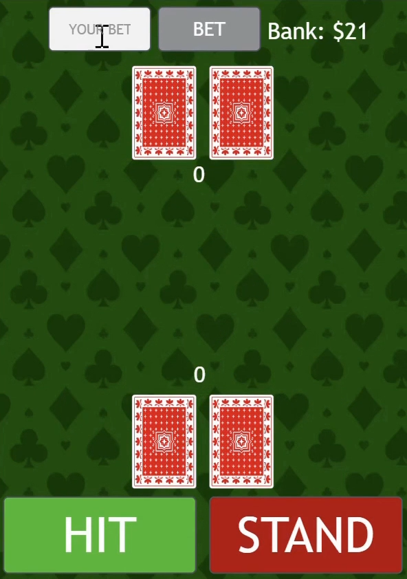
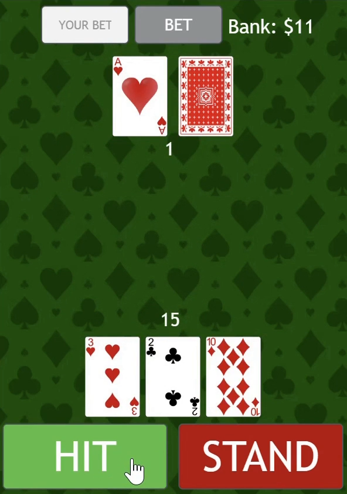

# RedJack

RedJack is a simplified variation of Blackjack built with JavaScript.

Features:
- Betting system
- Automatic Dealer
- Dynamic centered card positioning
- Multiple game states
- Outcome handling

# Screenshots:

