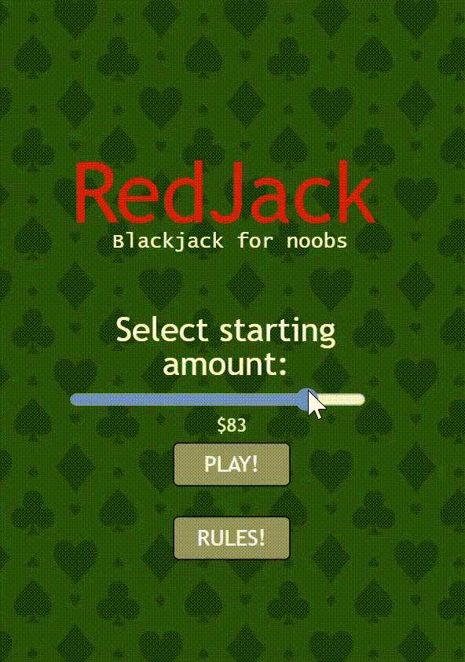

# RedJack

RedJack is a simplified variation of Blackjack built with JavaScript.
In this variation of Blackjack, Aces are worth 1, and there is no option to Split or Double.

Features:
- Betting system
- Automatic Dealer
- Dynamic centered card positioning
- Multiple game states
- Outcome handling
## Demo

# Screenshots:

